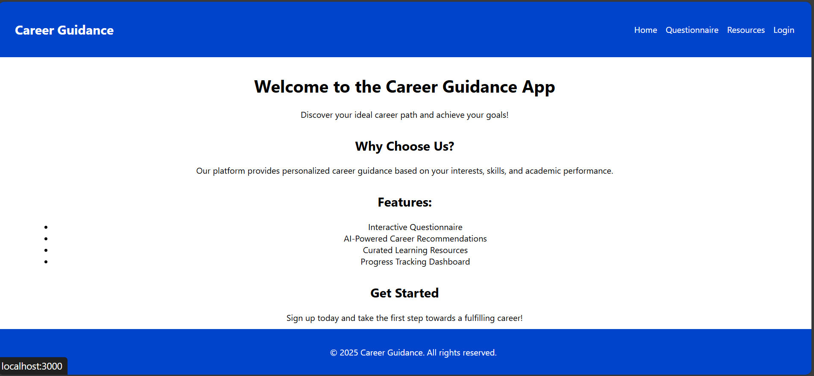

# NextStep-AI

A brief description of what this project does and who it's for

<h1 align="center">NextStep-AI</h1>

NextStep is an AI-powered career guidance platform designed to help students discover their perfect career path through personalized recommendations, market trend analysis, and skill assessments. Built with Django, React, and machine learning algorithms, NextStep bridges the gap between education and industry.


Contact
For any inquiries or feedback, please contact us at lakshaysinghal2909@gmail.com.

## 🔗 Links

[](https://linkedin.com/in/lakshay-singhal-44362917a)

[](https://twitter.com/)

## Screenshots
HomePage 


## Deployment

To deploy this project run
Installation

Clone the repository:

git clone https://github.com/Lakshaysinghal01/NextStep-AI.git

Navigate to the project directory:

```bash
cd NextStep-AI
Install the required dependencies:

pip install -r requirements.txt
npm install
Run the development server:

python manage.py runserver
npm start
```

## Usage

Register or log in to your account.

Complete your profile and skill assessments.

Explore personalized career recommendations and market trends.

Access resources and tools to enhance your skills and prepare for your chosen career path.


## Features

- Personalized Recommendations: Tailored career advice based on individual profiles and preferences.

- Market Trend Analysis: Insights into current and future job market trends.

- Skill Assessments: Evaluation of skills to identify strengths and areas for improvement.

- User-Friendly Interface: Intuitive and easy-to-navigate design for a seamless user experience.

- Technologies Used Backend: Python, Django

- Frontend: React, JavaScript

- Machine Learning: Various algorithms for personalized recommendations and trend analysis


